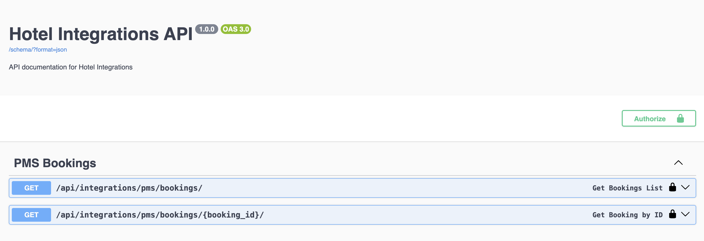

# hotel-api

Hotel management system Integrations API built with Django Rest Framework.

## Clone Project

    git clone https://github.com/vkmrishad/hotel-api.git

or

    git clone git@github.com:vkmrishad/hotel-api.git

## System dependencies

* [Python: 3.12+](https://www.python.org/downloads/)
* [PostgreSQL: 15+](https://www.postgresql.org/download/)
* [Pre-commit: 3.8.0](https://pre-commit.com/)
* [uv](https://docs.astral.sh/uv/)
* [Ruff](https://docs.astral.sh/ruff/)

## Python dependencies

All python dependencies are listed in [requirements.txt](requirements.txt) file.
[uv](https://docs.astral.sh/uv/) is used for managing python dependencies.

# Environment Variables

Copy `.env.example` to `.env` and update the values as needed.

# Format and Linting

Using [Ruff](https://docs.astral.sh/ruff/) for formatting and linting. This is added to pre-commit hook.

## Run project

    $ uvicorn core.asgi:application --reload

or

    $ ./manage.py runserver

or

    $ python3 manage.py migrate

## Migration

    $ ./manage.py migrate

or

    $ python3 manage.py migrate

## Run tests

    $ ./manage.py test

or

    $ python3 manage.py test

#### Access server: http://127.0.0.1:8000

### Check Swagger/Redoc documentation after running server

* [Swagger](http://127.0.0.1:8000/api/swagger/)
* [Redoc](http://127.0.0.1:8000/api/redoc/)

## Docker
Using [Docker](https://www.docker.com/) for containerization.

### Build Docker image and run container

    $ docker-compose up --build -d

or

    $ docker compose up --build -d

### Stop Docker container

    $ docker-compose down

or

    $ docker compose down

### Access Docker container

    $ docker exec -it hotel-api-app-1 bash

### Run migrations in Docker container

    $ docker exec -it hotel-api-app-1 python manage.py migrate

### Run tests in Docker container

    $ docker exec -it hotel-api-app-1 python manage.py test

## Run using Makefile
Using [Makefile](Makefile) for running commands.

### Build project

    $ make build

### Run project

    $ make up

### Stop project

    $ make down
